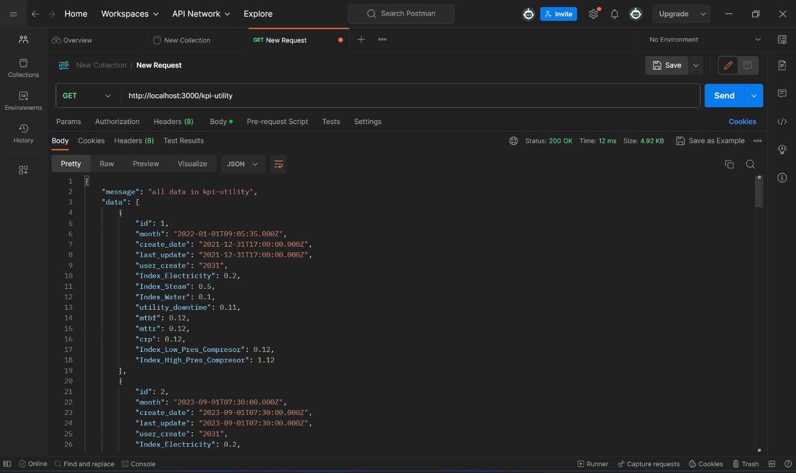
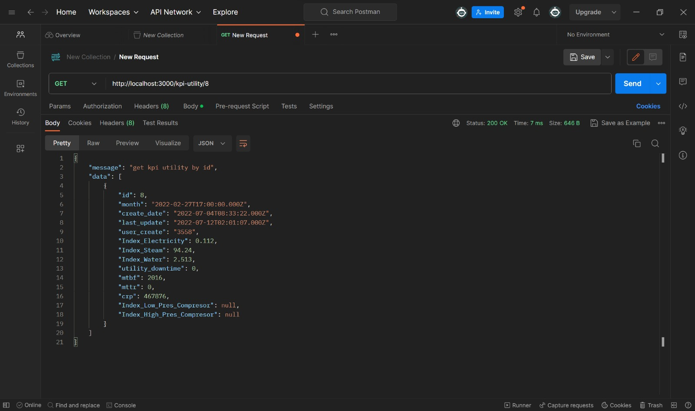
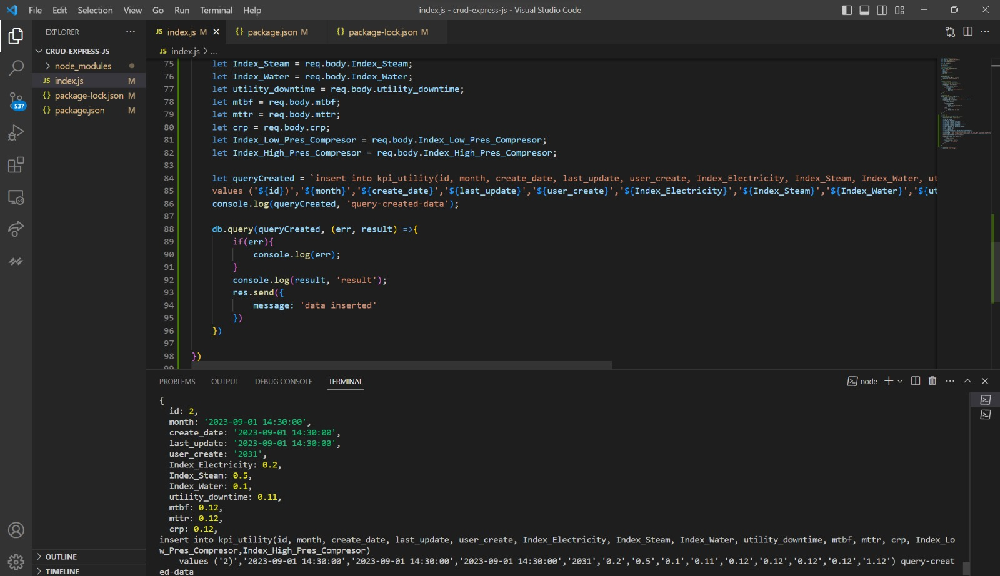
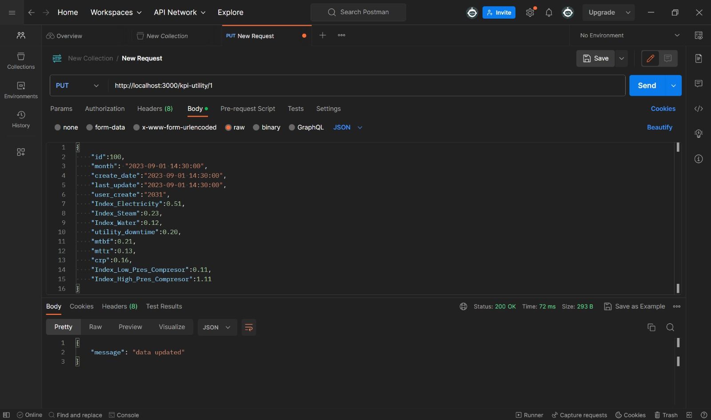
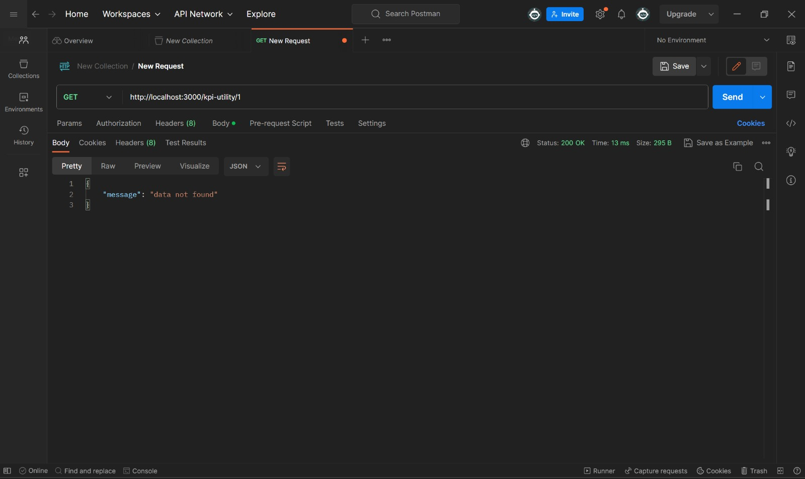
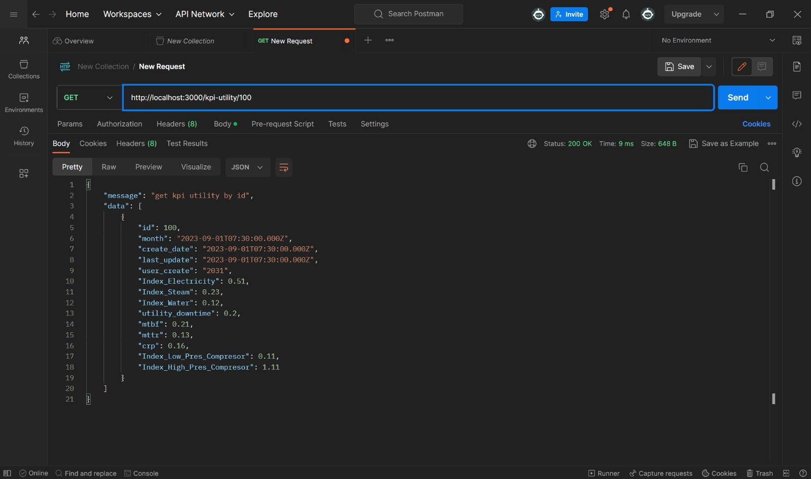
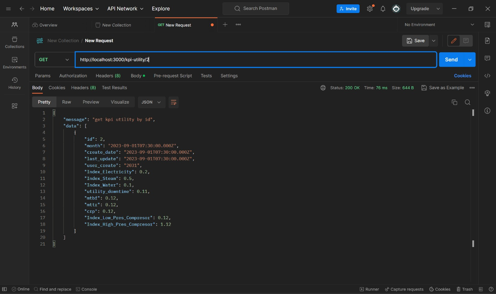
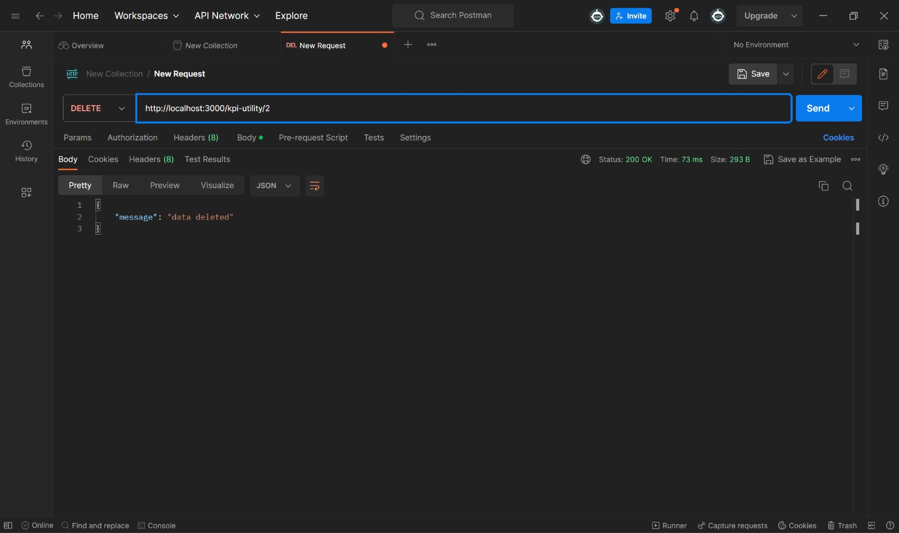

# Backend CRUD with Node.js, Express.js, Mysql

## Development 
- The first run `npm init -y` to create package.json
- Then, run `npm i express body-parser cors mysql2` to install the JavaScript packages needed in the project
- Install nodemon, run `npm i -g nodemon` (nodemon for file server in node.js)
- Run `nodemon index.js` to start backend express

----
## Show Data in Postman
This is the view for data kpi_utility that has been added.

 
----

## Get Data By Id in Postman 
Used to retrieve the "ID" from the kpi_utility data source (GET ID 8).

 
----

## Create / Insert New Data
Using the "post" method in postman and when successful the message "data inserted" will appear. (ADD NEW ID : 2)

### Success Insert

### Console Log Insert

 
----

## Update Data 
Update data in postman using the "PUT" method, and when successful the message "data updated".

### Update Success from ID 1 changed to ID 100

### If it has been updated then ID number 2 cannot be found

### Data check results when it has been updated

 
---
## Delete Data Product
The following shows delete data in Postman. (DELETE ID 2)

### Before Delete 

### Delete Data Success

### Data check results when it has been deleted

